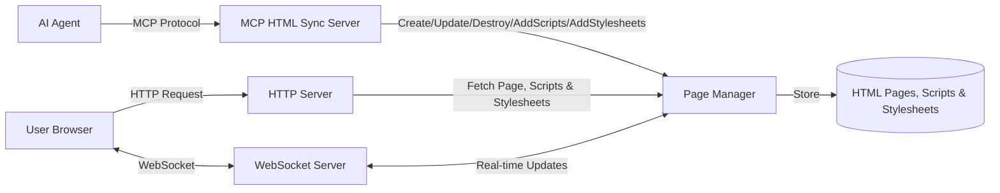

# MCP HTML Sync Server  

###### [Code of Conduct](https://github.com/yujiosaka/mcp-html-sync-server/blob/main/docs/CODE_OF_CONDUCT.md) | [Contributing](https://github.com/yujiosaka/mcp-html-sync-server/blob/main/docs/CONTRIBUTING.md) | [Security](https://github.com/yujiosaka/mcp-html-sync-server/blob/main/docs/SECURITY.md)

A real-time HTML syncing server with hot reload capabilities, built using the Model Context Protocol (MCP). This server enables AI agents to create, update, and destroy HTML pages dynamically, with all connected clients receiving updates in real-time.

## Features


- **Real-time HTML Syncing**: Create and update HTML content with instant updates to all connected clients
- **WebSocket Hot Reload**: All connected browsers automatically refresh when content changes
- **Script Management**: Add JavaScript scripts to pages, either via CDN URLs or inline content
- **Stylesheet Management**: Add CSS stylesheets to pages via CDN URLs
- **MCP Integration**: Designed specifically for AI agents using the Model Context Protocol
- **Page Lifecycle Management**: Automatic expiration of pages after configurable time periods
- **Connection Limits**: Configurable maximum page count with automatic cleanup of oldest pages
- **Simple API**: Easy-to-use MCP tools for page creation, updating, and destruction
- **Lightweight**: Minimal dependencies and efficient resource usage

## Architecture



## Installation

### Using Docker

```bash
docker pull yujiosaka/mcp-html-sync-server
docker run -p 3000:3000 yujiosaka/mcp-html-sync-server
```

### Using NPX

```bash
NODE_ENV=production npx mcp-html-sync-server
```

### From Source

```bash
# Clone the repository
git clone https://github.com/yujiosaka/mcp-html-sync-server.git
cd mcp-html-sync-server

# Install dependencies
bun install

# Copy the example environment file
bun run config

# Start the server
bun run start
```

## Configuration

Edit the `.env` file to configure the server:

```
# Host address for the HTTP server (also used by MCP server for generating view URLs)
SERVER_HOST=localhost
# Port number for the HTTP server (also used by MCP server for generating view URLs)
SERVER_PORT=3000
# Maximum age of pages before they expire (e.g., 5m = 5 minutes, uses ms library format)
PAGE_MAX_AGE=5m
# Maximum number of pages that can be stored (oldest pages are removed when limit is reached)
PAGE_MAX_COUNT=100
```

### Configuration Options

| Option | Description | Default | Format |
|--------|-------------|---------|--------|
| SERVER_HOST | Host address for the HTTP server | localhost | hostname |
| SERVER_PORT | Port number for the HTTP server | 3000 | number |
| PAGE_MAX_AGE | Maximum age of pages before expiration | 5m | time string (e.g., 1h, 30m, 1d) |
| PAGE_MAX_COUNT | Maximum number of pages to keep | 100 | number |

## Usage with MCP

### Integration with Claude Desktop

Add this to your `claude_desktop_config.json`:

#### Docker

```json
{
  "mcpServers": {
    "html-sync-server": {
      "command": "docker",
      "args": [
        "run",
        "-i",
        "--rm",
        "-p",
        "3000:3000",
        "yujiosaka/mcp-html-sync-server"
      ]
    }
  }
}
```

#### NPX

```json
{
  "mcpServers": {
    "html-sync-server": {
      "command": "npx",
      "args": ["-y", "mcp-html-sync-server"],
      "env": {
        "NODE_ENV": "production"
      }
    }
  }
}
```

### Integration with VS Code

For quick installation, use one of the one-click install buttons below:

[](https://insiders.vscode.dev/redirect/mcp/install?name=html-sync-server&config=%7B%22command%22%3A%22npx%22%2C%22args%22%3A%5B%22-y%22%2C%22mcp-html-sync-server%22%5D%2C%22env%22%3A%7B%22NODE_ENV%22%3A%22production%22%7D%7D) [](https://insiders.vscode.dev/redirect/mcp/install?name=html-sync-server&config=%7B%22command%22%3A%22npx%22%2C%22args%22%3A%5B%22-y%22%2C%22mcp-html-sync-server%22%5D%2C%22env%22%3A%7B%22NODE_ENV%22%3A%22production%22%7D%7D&quality=insiders)

[](https://insiders.vscode.dev/redirect/mcp/install?name=html-sync-server&config=%7B%22command%22%3A%22docker%22%2C%22args%22%3A%5B%22run%22%2C%22-i%22%2C%22--rm%22%2C%22-p%22%2C%223000%3A3000%22%2C%22yujiosaka%2Fmcp-html-sync-server%22%5D%7D) [](https://insiders.vscode.dev/redirect/mcp/install?name=html-sync-server&config=%7B%22command%22%3A%22docker%22%2C%22args%22%3A%5B%22run%22%2C%22-i%22%2C%22--rm%22%2C%22-p%22%2C%223000%3A3000%22%2C%22yujiosaka%2Fmcp-html-sync-server%22%5D%7D&quality=insiders)

#### Manual Installation

For manual installation, add the following JSON block to your User Settings (JSON) file in VS Code. You can do this by pressing `Ctrl + Shift + P` and typing `Preferences: Open Settings (JSON)`.

Optionally, you can add it to a file called `.vscode/mcp.json` in your workspace. This will allow you to share the configuration with others.

> Note that the `mcp` key is not needed in the `.vscode/mcp.json` file.

```json
{
  "mcp": {
    "servers": {
      "html-sync-server": {
        "command": "npx",
        "args": ["-y", "mcp-html-sync-server"],
        "env": {
          "NODE_ENV": "production"
        }
      }
    }
  }
}
```

For Docker installation:

```json
{
  "mcp": {
    "servers": {
      "html-sync-server": {
        "command": "docker",
        "args": ["run", "-i", "--rm", "-p", "3000:3000", "yujiosaka/mcp-html-sync-server"]
      }
    }
  }
}
```

## MCP Tools

The server provides the following MCP tools that can be used by AI agents:

### 1. Create a Page

Creates a new HTML page with the specified content.

**Tool Name**: `create_page`

**Input Schema**:
```json
{
  "type": "object",
  "properties": {
    "body": {
      "type": "string",
      "description": "HTML content for the page body"
    },
    "scripts": {
      "type": "array",
      "description": "Optional array of JavaScript scripts to include in the page",
      "items": {
        "type": "object",
        "properties": {
          "src": {
            "type": "string",
            "description": "URL for external script"
          },
          "content": {
            "type": "string",
            "description": "Content for inline script"
          }
        },
        "description": "Either src or content must be provided",
        "oneOf": [
          { "required": ["src"] },
          { "required": ["content"] }
        ]
      }
    },
    "stylesheets": {
      "type": "array",
      "description": "Optional array of CSS stylesheets to include in the page",
      "items": {
        "type": "object",
        "properties": {
          "href": {
            "type": "string",
            "description": "URL for external stylesheet"
          }
        },
        "required": ["href"]
      }
    }
  },
  "required": ["body"]
}
```

**Example Request**:
```json
{
  "name": "create_page",
  "arguments": {
    "body": "<h1>Hello World</h1><p>This is my page content.</p><button id='confetti-btn'>Click for Confetti!</button>",
    "scripts": [
      { "src": "https://cdn.jsdelivr.net/npm/bootstrap@5.3.5/dist/js/bootstrap.bundle.min.js" }
    ],
    "stylesheets": [
      { "href": "https://cdn.jsdelivr.net/npm/bootstrap@5.3.5/dist/css/bootstrap.min.css" }
    ]
  }
}
```

**Example Response**:
```json
{
  "url": "http://localhost:3000/abc123",
  "id": "abc123"
}
```

### 2. Update a Page

Updates an existing page with new content. All connected clients will see the updates in real-time. If the page does not exist (has been removed or expired), an error response will be returned.

**Tool Name**: `update_page`

**Input Schema**:
```json
{
  "type": "object",
  "properties": {
    "id": {
      "type": "string",
      "description": "ID of the page to update"
    },
    "body": {
      "type": "string",
      "description": "New HTML content for the page body"
    }
  },
  "required": ["id", "body"]
}
```

**Example Request**:
```json
{
  "name": "update_page",
  "arguments": {
    "id": "abc123",
    "body": "<h1>Updated Content</h1><p>This content has been updated.</p>"
  }
}
```

**Example Response**:
```json
{
  "success": true
}
```

### 3. Destroy a Page

Removes a page and disconnects all clients.

**Tool Name**: `destroy_page`

**Input Schema**:
```json
{
  "type": "object",
  "properties": {
    "id": {
      "type": "string",
      "description": "ID of the page to destroy"
    }
  },
  "required": ["id"]
}
```

**Example Request**:
```json
{
  "name": "destroy_page",
  "arguments": {
    "id": "abc123"
  }
}
```

**Example Response**:
```json
{
  "success": true
}
```

### 4. Add Scripts to a Page

Adds JavaScript scripts to an existing page. All connected clients will receive the scripts in real-time.

**Tool Name**: `add_scripts`

**Input Schema**:
```json
{
  "type": "object",
  "properties": {
    "id": {
      "type": "string",
      "description": "ID of the page to add scripts to"
    },
    "scripts": {
      "type": "array",
      "description": "Array of JavaScript scripts to add to the page",
      "items": {
        "type": "object",
        "properties": {
          "src": {
            "type": "string",
            "description": "URL for external script"
          },
          "content": {
            "type": "string",
            "description": "Content for inline script"
          }
        },
        "description": "Either src or content must be provided",
        "oneOf": [
          { "required": ["src"] },
          { "required": ["content"] }
        ]
      }
    }
  },
  "required": ["id", "scripts"]
}
```

**Example Request**:
```json
{
  "name": "add_scripts",
  "arguments": {
    "id": "abc123",
    "scripts": [
      { "content": "alert('Hello World!')" }
    ]
  }
}
```

**Example Response**:
```json
{
  "success": true
}
```

### 5. Add Stylesheets to a Page

Adds CSS stylesheets to an existing page. All connected clients will receive the stylesheets in real-time.

**Tool Name**: `add_stylesheets`

**Input Schema**:
```json
{
  "type": "object",
  "properties": {
    "id": {
      "type": "string",
      "description": "ID of the page to add stylesheets to"
    },
    "stylesheets": {
      "type": "array",
      "description": "Array of CSS stylesheets to add to the page",
      "items": {
        "type": "object",
        "properties": {
          "href": {
            "type": "string",
            "description": "URL for external stylesheet"
          }
        },
        "required": ["href"]
      }
    }
  },
  "required": ["id", "stylesheets"]
}
```

**Example Request**:
```json
{
  "name": "add_stylesheets",
  "arguments": {
    "id": "abc123",
    "stylesheets": [
      { "href": "https://cdn.jsdelivr.net/npm/bootstrap@5.3.5/dist/css/bootstrap.min.css" }
    ]
  }
}
```

**Example Response**:
```json
{
  "content": [
    {
      "type": "text",
      "text": "Stylesheets added successfully!\nID: abc123\nURL: http://localhost:3000/abc123\nExpires: 2023-04-15T12:34:56.789Z"
    }
  ]
}
```

## How It Works

1. AI agents interact with the server through the Model Context Protocol (MCP)
2. The MCP server processes requests to create, update, or destroy HTML pages
3. Users view these pages through URLs provided by the AI agent
4. Real-time updates are delivered to all connected clients via WebSockets

## Manual Testing

The project includes a manual test script (`manual-test.ts`) that demonstrates how to use the MCP server. This script:

1. Creates a new HTML page with canvas-confetti from CDN
2. Updates the page content
3. Adds stylesheets to trigger text animations
4. Adds scripts to trigger confetti animations
5. Deletes the page

To run the manual test:

```bash
# Run the test script
bun manual-test.ts
```

The script will provide URLs that you can open in your browser to see the page and observe real-time updates. It uses an interactive approach with confirmation prompts between each step, allowing you to verify the changes in your browser before proceeding to the next step.

This test script is particularly useful for:
- Verifying that the MCP server is working correctly
- Understanding the flow of creating, updating, and destroying pages
- Observing real-time WebSocket updates in the browser

## Development

```bash
# Run in development mode with auto-reload
bun run dev

# Build the project
bun run build

# Run linting
bun run check

# Fix linting issues
bun run check:write
```

## Troubleshooting

### Port Already in Use

If you see an error like the following when starting the server:

```
[2025-04-28 18:28:48.370 +0900] ERROR: Error starting server
    err: {
      "type": "Error",
      "message": "Failed to start server. Is port 3000 in use?",
      "stack":
          Error
              at serve (unknown)
              at [kRealListen] (node:http:565:41)
              at listen (node:http:542:35)
              at <anonymous> (/Users/yujiisobe/work/mcp-html-sync-server/node_modules/fastify/lib/server.js:265:12)
              at processTicksAndRejections (unknown:7:39)
      "code": "EADDRINUSE",
      "syscall": "listen",
      "errno": 0
    }
```

This means that port 3000 (or whatever port you've configured) is already being used by another application. To resolve this:

1. **Change the port**: Edit the `.env` file and change the `SERVER_PORT` to a different value (e.g., 3001, 8080, etc.)

2. **Stop the other application**: Find and stop the application that's using port 3000. You can use one of these commands to find processes using the port:
   
   ```bash
   # On macOS/Linux
   lsof -i :3000
   
   # On Windows
   netstat -ano | findstr :3000
   ```

3. **Restart your computer**: In some cases, a restart can clear orphaned processes that might be holding onto the port.

When using the server with Claude Desktop or VS Code, you may also see JSON parsing errors if the port is already in use. These errors occur because the server can't start properly and is returning error messages instead of valid JSON responses.

## Building Docker Image

```bash
docker build -t yujiosaka/mcp-html-sync-server .
```

## License

This project is licensed under the MIT License. See [LICENSE](LICENSE) for details.
